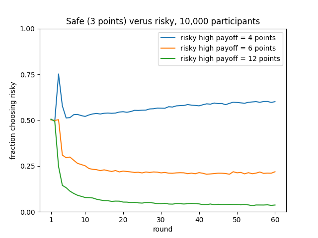

Binary choice example
*********************

Here is described a simple example of using PyIBL, in this case modeling a simple binary choice task.
In this task the virtual participant is asked repeatedly to choose between two options, one safe and one risky,
trying to learn from experience how to maximize the total points they earn.
Choosing the safe option always earns three points, but choosing the risky option sometimes earns a fixed value greater than three,
but others earns no points. There are three conditions to this experiment, each with that fixed, higher payout having a particular
value. In all three conditions that higher payout and the probability of earning it are chosen so that the expected value
of the choice is exactly three, the same as the safe choice.
Thus, if given exact, descriptive knowledge of what will be earned a fully rational participant would know it doesn’t really matter
which choice is made, but most actual humans do show a preference one way or another.
The goal here is to see PyIBL mimic that behavior. Here are the rewards for the two options in the three different conditions, together
with the probability of the high reward if the risky option is chosen:

=========  =========  =========  ==========  ===================
condition  safe       risky low  risky high  probability of high
=========  =========  =========  ==========  ===================
4          3 points   0 points   4 points    0.75
6          3 points   0 points   6 points    0.5
12         3 points   0 points   12 points   0.25
=========  =========  =========  ==========  ===================

In this example each participant is asked to perform this task sixty times, learning what to expect over these sixty rounds.
There are 10,000 virtual participants in each condition, each completely independent of one another.
We plot, using the Python `Matplotlib <https://matplotlib.org/>`_ library, for each condition, the mean over the 10,000 participants of how often the risky choice was made at each round,
displaying there preference of the virtual participants between the safe and risky options as it evolves with increased
experience. Because running this model for 1.8 million choices (3 conditions × 60 rounds × 10,000 participants) typically requires
several minutes we also display a progress indicator of how far along the model is, using the Python library `tqdm <https://tqdm.github.io/>`_.

After exploring this model, we also construct two slightly amended versions. The first shows how, in addition to displaying the plot
of the frequency of choosing risky, to capture a CSV file of the details of each iteration for offline analysis.
The second shows a way to take advantage of a multi-core machine to speed up the modeling by running model in multiple, concurrent
processes.

:download:`Click here to download </_downloads/binary-choice.zip>` a zipped archive for the three versions of the code
of the binary choice example described here, along with a ``requirements.txt`` file. The recommended way of running these
examples yourself is to create and activate a virtual environment using venv or conda, doing ``pip install -r requirements.txt`` in
it, and then in it running Python on the desired model file.

Here is the initial version (available as ``binary_choice.py`` in the download, above), followed by a detailed description thereof:

.. code-block:: python
    :linenos:

    # Copyright 2024 Carnegie Mellon University
    # Binary choice example using PyIBL

    import matplotlib.pyplot as plt
    import numpy as np
    from pyibl import Agent
    from random import random
    from tqdm import tqdm

    HIGH_PAYOUTS = [4, 6, 12]
    SAFE_PAYOUT = 3
    PLOT_FILE = "binary-choice.png"
    ROUNDS = 60
    PARTICIPANTS = 10_000
    PREPOPULATED_MULTIPLIER = 1.2

    def run_condition(high_payout, progress):
        results = []
        high_probability = SAFE_PAYOUT / high_payout
        for participant in range(PARTICIPANTS):
            agent = Agent(default_utility=(PREPOPULATED_MULTIPLIER * high_payout))
            round_results = [0] * ROUNDS
            for round in range(ROUNDS):
                choice = agent.choose(["safe", "risky"])
                if choice == "safe":
                    payoff = SAFE_PAYOUT
                elif random() < high_probability:
                    payoff = high_payout
                else:
                    payoff = 0
                agent.respond(payoff)
                round_results[round] = int(choice == "risky")
            results.append(round_results)
            progress.update()
        return results

    def main():
        progress = tqdm(total=(len(HIGH_PAYOUTS) * PARTICIPANTS))
        for payout in HIGH_PAYOUTS:
            plt.plot(range(1, ROUNDS + 1),
                     np.mean(np.asarray(run_condition(payout, progress)), axis=0),
                     label=f"risky high payoff = {payout} points")
        plt.xticks([1] + [10 * n for n in range(1, round((ROUNDS + 10) / 10))])
        plt.ylim([0, 1])
        plt.yticks([round(n / 4, 2) for n in range(5)])
        plt.ylabel("fraction choosing risky")
        plt.xlabel("round")
        plt.legend()
        plt.title(f"Safe ({SAFE_PAYOUT} points) versus risky, {PARTICIPANTS:,} participants")
        plt.savefig(PLOT_FILE)

    if __name__ == '__main__':
        main()

First (lines 4–8) are imported the various Python modules needed:

* the PyIBL ``Agent`` class
* the ``random()`` method of the Python `random <https://docs.python.org/3.8/library/random.html>`_ module,
  which will be used for resolving the gamble implicit in the risky option
* the `NumPy <https://numpy.org/>`_ Python library which will be used for averaging results for plotting
* the `pyplot <https://matplotlib.org/stable/tutorials/pyplot.html>`_ interface to Matplotlib
* the tqdm module

Next (lines 10–15) are defined various constants used by the model. ``HIGH_PAYOUTS`` is a list of the three
possible high results of the risky gamble, these values also serving as the names of the three conditions.
Also define here is the reward of the safe option, the file in which to save the resulting plot, the number
of rounds and virtual participants, and a factor used in computing the utilities of options that have not
yet been seen, as described below.

The model *per se* is defined in the ``run_condition()`` function on lines 17–35. The condition is specified by
its first argument, and a tqdm object is passed in as its second argument, to be updated each time a participant’s
choices are concluded. The results of every choice for each participant, encoded as ``0`` for safe and ``1`` for risky,
are accumulated into the ``results`` local variable, each participant’s results appearing in a separate sub-list.
The probability of a high reward from the risky option is computed from the values of that reward and the safe one
so as to ensure the expected value of the risky option’s reward is the same as the safe reward.

After these preliminaries each participant is looped over.
An ``Agent`` is allocated for the participant. The ``default_utility`` of this agent is set to a value
slightly above the maximum possible reward of an actual choice to ensure random exploration of both options; once
the results of any real experiences of the options have been experienced by this participant the ``default_utility`` is
ignored. The sub-list to accumulate this participant’s results is allocated on line 22; each value is initialized
to ``None``, but will be updated a few lines below.

Now, for this participant, the sixty rounds are played. First (line 24) a choice is made between safe or risky.
Then (lines 23–30) the reward for this choice is computed. On line 31 the ``Agent`` is told the value of this
reward, and on line 32 it is recorded as a zero or one for subsequent reporting.

Once all sixty rounds have been played the sub-list recording this participant’s choices is appended to the
list of the entire condition’s results. Then the progress indicator is updated to note that this participants
activities have finished, and the next participant’s choices commence. After all the participants have
finished running the total results, a list of lists, is returned.

The ``main()`` finction (lines 37–51) first allocates a tqdm progress indicator. It then loops over the three
conditions (line 39) calling ``run_condition()`` for each and passing in the progress indicator (line 41), and
uses NumPy to compute the means across participants of the results of each round’s results, each mean being a
number between zero and one since the individual results are all zeros and ones (also line 39). Lines 40–50
construct and save the resulting plot. Lines 52–53 are the usual Python module boilerplate for ensuring that
the ``main()`` function is called if the file is simply loaded as ``python binary-choice.py``.

The resulting plot from one run of this model looks like the following. Note that other runs will differ slightly
because the model is stochastic. However the differences will be subtle as most are averaged out wince we are
running the model over a large number of participants.

From this plot we can see that when the high reward from the risky option is frequent (the 4 condition, at 75%) as
experience accumulates it is slightly preferred. But when it is infrequent, but higher (the 6 and 12 conditions, at 50% and 25%, respectively)
the safe option is preferred instead. The spike in the first few rounds for the 4 condition reflects that the high payout occurs frequently during
the initial, random exploration, but it subsides after a few rounds of real experience have accumulated.

Adding a log file
=================

When running models like this it is often desired not just to see the average results, but to see
and perform analysis on the details of each choice for each participant. This is often easily facilitated
by writing a CSV file of the results. This can be added using the Python `csv <https://docs.python.org/3.8/library/csv.html>`_ module.

Here is one way to add this, also available as the file ``binary_choice_with-log.py`` in the download above.

.. code-block:: python
    :linenos:

    # Copyright 2024 Carnegie Mellon University
    # Binary choice example using PyIBL writing a log file

    import csv
    import matplotlib.pyplot as plt
    import numpy as np
    from pyibl import Agent
    from random import random
    from tqdm import tqdm

    HIGH_PAYOUTS = [4, 6, 12]
    SAFE_PAYOUT = 3
    PLOT_FILE = "binary-choice.png"
    LOG_FILE = "binary-choice-log.csv"
    ROUNDS = 60
    PARTICIPANTS = 10_000
    PREPOPULATED_MULTIPLIER = 1.2

    def run_condition(high_payout, log, progress):
        results = []
        high_probability = SAFE_PAYOUT / high_payout
        for participant in range(PARTICIPANTS):
            agent = Agent(default_utility=(PREPOPULATED_MULTIPLIER * high_payout))
            round_results = [None] * ROUNDS
            for round in range(ROUNDS):
                choice = agent.choose(["safe", "risky"])
                if choice == "safe":
                    payoff = SAFE_PAYOUT
                elif random() < high_probability:
                    payoff = high_payout
                else:
                    payoff = 0
                agent.respond(payoff)
                round_results[round] = int(choice == "risky")
                log.writerow([high_payout, participant + 1, round + 1, SAFE_PAYOUT, high_payout, high_probability, choice, payoff])
            results.append(round_results)
            progress.update()
        return results

    def main():
        progress = tqdm(total=(len(HIGH_PAYOUTS) * PARTICIPANTS))
        results = {}
        with open(LOG_FILE, "w", newline="") as file:
            writer = csv.writer(file)
            # write the header of the CSV log file
            writer.writerow("condition,participant,round,safe payout,risky high payout,risky high probability,choice,reward".split(","))
            for payout in HIGH_PAYOUTS:
                plt.plot(range(1, ROUNDS + 1),
                         np.mean(np.asarray(run_condition(payout, writer, progress)), axis=0),
                         label=f"risky high payoff = {payout} points")
        plt.xticks([1] + [10 * n for n in range(1, round((ROUNDS + 10) / 10))])
        plt.ylim([0, 1])
        plt.yticks([round(n / 4, 2) for n in range(5)])
        plt.ylabel("fraction choosing risky")
        plt.xlabel("round")
        plt.legend()
        plt.title(f"Safe ({SAFE_PAYOUT} points) verus risky, {PARTICIPANTS:,} participants")
        plt.savefig(PLOT_FILE)

    if __name__ == '__main__':
        main()

On line 4 we import the csv module. One lines 43-44 we open the desired CSV file to which to write the details,
and allocate a ``csv.writer`` object to correctly format the results. One line 46 we write the initial header
row of the CSV file; the file will describe eight columns, the condition, participant and round, together with details of the various
gambles, and finally the actual choice made by the model for that participant and round together with the resulting actual reward.
On line 35 we write the row corresponding to a single choice being made. While the model counts rounds and participants starting
from zero, it is often preferred to count them starting from one, so we add one to them when writing them here.
Everything else in this revised model is the same as in the original one.

The resulting ``binary-choice-log.csv`` file consists of nearly two million lines,
and is about 43 megabytes.
Here are its first few and last few lines; if you run it yourself the results will be similar
but slightly different because the model is stochastic:

::

    condition,participant,round,safe payout,risky high payout,risky high probability,choice,reward
    4,1,1,3,4,0.75,risky,4
    4,1,2,3,4,0.75,safe,3
    4,1,3,3,4,0.75,risky,0
    4,1,4,3,4,0.75,safe,3
    4,1,5,3,4,0.75,safe,3
    4,1,6,3,4,0.75,risky,4
    4,1,7,3,4,0.75,risky,0
    4,1,8,3,4,0.75,safe,3
    4,1,9,3,4,0.75,safe,3
    ...
    12,10000,54,3,12,0.25,safe,3
    12,10000,55,3,12,0.25,safe,3
    12,10000,56,3,12,0.25,risky,0
    12,10000,57,3,12,0.25,safe,3
    12,10000,58,3,12,0.25,safe,3
    12,10000,59,3,12,0.25,safe,3
    12,10000,60,3,12,0.25,safe,3

Using multiple processes
========================

As noted above this model typically requires several minutes to run.
If you have a multi-core machine available you can often speed up models
such as this, which involve multiple, independent virtual participants
by partitioning the participants across multiple, concurrent processes.

This example does that, and the code is also available as ``multiple_processes.py`` in
the download above.

.. code-block:: python
    :linenos:

    # Copyright 2024 Carnegie Mellon University
    # Binary choice example using PyIBL and multiple processes

    from alhazen import IteratedExperiment
    import matplotlib.pyplot as plt
    import numpy as np
    from pyibl import Agent
    from random import random

    HIGH_PAYOUTS = [4, 6, 12]
    SAFE_PAYOUT = 3
    PLOT_FILE = "binary-choice.png"
    ROUNDS = 60
    PARTICIPANTS = 10_000
    PREPOPULATED_MULTIPLIER = 1.2
    PROCESSES = 0

    class BinaryChoice(IteratedExperiment):

        def prepare_condition(self, condition, context):
            context["high-probability"] = SAFE_PAYOUT / condition

        def run_participant_prepare(self, participant, condition, context):
            self.agent = Agent(default_utility=(PREPOPULATED_MULTIPLIER * condition))

        def run_participant_run(self, round, participant, condition, context):
            choice = self.agent.choose(["safe", "risky"])
            if choice == "safe":
                payoff = SAFE_PAYOUT
            elif random() < context["high-probability"]:
                payoff = condition
            else:
                payoff = 0
            self.agent.respond(payoff)
            return int(choice == "risky")

    def main():
          exp = BinaryChoice(rounds=ROUNDS,
                             conditions=HIGH_PAYOUTS,
                             participants=PARTICIPANTS,
                             process_count=PROCESSES)
          results = exp.run()
          for condition in exp.conditions:
              plt.plot(range(1, ROUNDS + 1), np.mean(np.asarray(results[condition]), axis=0),
                       label=f"risky high payoff = {condition} points")
          plt.xticks([1] + [10 * n for n in range(1, round((ROUNDS + 10) / 10))])
          plt.ylim([0, 1])
          plt.yticks([round(n / 4, 2) for n in range(5)])
          plt.ylabel("fraction choosing risky")
          plt.xlabel("round")
          plt.legend()
          plt.title(f"Safe ({SAFE_PAYOUT} points) verus risky, {PARTICIPANTS:,} participants")
          plt.savefig(PLOT_FILE)

    if __name__ == '__main__':
        main()

To simplify the division across processes we use the `Alhazen <http://koalemos.psy.cmu.edu/alhazen/>`_ library which is intended for just this purpose.
Installation of Alhazen is included in the download’s ``requirements.txt``, or it can be installed with ``pip install alhazen``. We import it
on line 4 of the example. Because Alhazen can supply its own tqdm progress indicator we no longer have to import tqdm ourselves. On line 16 we
define a constant that will be used later to tell Alhazen how many parallel processes we’d like to run; setting it to zero tells Alhazen to use
its understanding of the host machines architecture to estimate what is the largest number it can run concurrently.

To use Alhazen we must subclass the Alhazen ``IteratedExperiment`` class (lines 18–35), and divide the work formerly in the ``run_condition()`` function
across the three ``IteratedExperiment`` methods ``prepare_condition()``, ``run_participant_prepare()`` and ``run_participant_run()``. We no
longer have to accumulate the results as Alhazen does that for us; instead ``run_participant_run()`` simply needs to return the result
of running its single round of a single participant in the relevant condition.

In the ``main()`` function on lines 38–41 we allocate an instance of our subclass, passing in the conditions, numbers of rounds and participants, and desired
number of concurrent preocesses. On line 42 we call this instance’s ``run()`` method, which returns a dictionary mapping each condition
name to a list of lists just like those ``run_condition()`` did in our original implementation. On lines 43–53 we pick apart this dictionary and use
it to create a plot just as we did earlier.

On a machine in the DDMLab, a System76 Thelio Major with a 2.2 GHz AMD Ryzen 3990X 64-core CPU, running the original model requires a little over four minutes.
But running this multi-process model using all 64 cores in parallel requires only six seconds. More modest improvements can be seen in more common
processors with fewer cores; we can approximate the improvements possible on such machines by running the multi-process model on this same machine but setting
the ``PROCESSES`` constant to values less than 64. Here are results for some values. Note that if run again these times might change slightly,
as they are sensitive to many aspects of the machine’s operation and status, but they largely reflect a nearly linear improvement in execution time
with increasing core use; that this linear trend tails off at the fastest times reflects that less time is being spend running the model, so the total time
more reflects the constant time required to render the plot, which is not aided by multiple processes.

===================  ===============================
Number of processes  Time required (minutes:seconds)
===================  ===============================
1                    4:04
2                    2:05
4                    1:02
8                    0:32
16                   0:16
32                   0:09
64                   0:06
===================  ===============================

|
|
